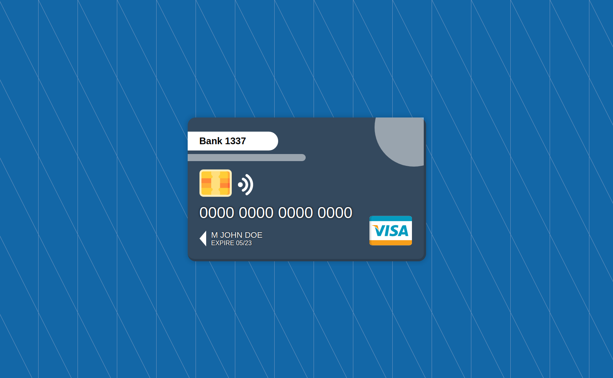

# Projet-CSS-credit-card
It's a little training project for level up CSS.

...[Tutorial from Nicolas Brondin-Bernard](https://blog.nicolas.brondin-bernard.com/tutoriel-creer-une-carte-de-credit-responsive-en-html-css/)...
...[Résult of this tuto](https://henriteinturier.github.io/Training-CSS-credit-card/)...

## notions reviewed or learned
### flex-box for center 
Using Flex-box for center the card
### Padding-top % + width
When you apply a percentage size to a padding-top, the size will be calculated according to the width of the element and not its height, that's why it makes it easy to keep a ratio.
### position absolute & relative
A little revision
### Text-shadow & border-shadow
A little revision
### Create triangular in CSS
exemple: 
width: 0; 
height: 0; 
border-top: 20px solid transparent;
border-bottom: 20px solid transparent; 
border-right:17px solid white; 
### Decoration ::after & ::before
The ideal when you want to draw something that does not bring any semantics to your page is to use the '::before' and '::after' pseudo-elements.
### Transition
Allows you to choose a duration, delays, ... to be taken into account for a transformation.
### transform: Scale and rotate
A very simple method to animate an element is to modify some of these attributes during an event (for example:hover) and to apply a transition animation on the element globally.
Here we play on the zoom, the rotation and the box-shadow to give a levitation effect.
### Responsive & @media screen and (max-width: xpx)
A little revision

